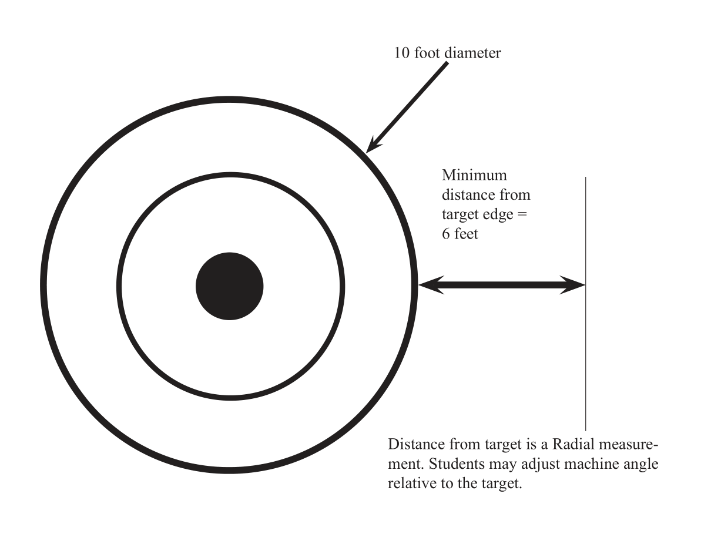
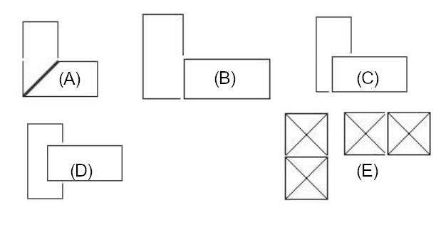
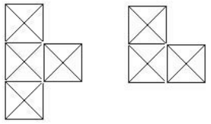
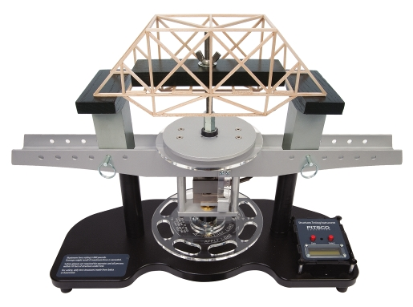

# 2023-24 Broward Student Technology Association (BSTA) High School Competition Handbook
## Monday, April 8th, 2024 at J.P. Taravella High School

# These Rules Are Subject to Change as Participants Review for Errors or Inconsistencies.

## Table of Contents
1. Aerospace - Flight Challenge
2. Aerospace - Hydro Rockets
3. Graphic Design - Logo Design
4. Machines - Trebuchet
5. Robotics - VEX Over Under
6. Structures - Bridge Design
7. Transportation - CO2 Dragsters
## Flight Challenge
### Overview
Participants analyze flight principles with a rubber band powered model aircraft.
### Challenge
Build, fly, and adjust (trim) a model to make long endurance flights inside a contained airspace. Any model design is acceptable if the model complies with the event specifications. All models are to be built and test flown before the event date.
### Eligibility
-	Entries are limited to five (5) teams per school, 1 member per team.  
-	Entries must be started and completed during the current school year.
### Procedure
-	Participants are provided a minimum of thirty (30) minutes for trim flights at the event site.
-	Models are evaluated for specification compliance during the trim session. Time allotted for the trim portion may be extended according to the number of participants and site scheduling.
-	Participants have two (2) opportunities to fly their models for official times.
-	Participants attend a pilot's meeting to review the sequence for making the official flights.
-	In an orderly fashion, participants wind their models and proceed to a group timer for permission to fly.
-	Participants place their models on the floor and wait for the signal to release from the timer. Timing begins when the model rises off the ground.
-	Flight time ends when models hit the floor/ground or when they touch an obstruction.
-	No repairs are allowed after time trials begin.
-	Each participant has the times of two (2) official flights recorded by the timer.
### Regulations
-	Models are to be made of wood and tissue paper for fuselage and flying surfaces (wings, fin, and stabilizer). No plastic foams, films, or condenser paper are allowed.
-	Models use a commercially available plastic propeller or propeller assembly: minimum of 140mm to a maximum of 170mm in diameter. Trimming or thinning propellers is allowed to achieve balance and/or to reduce weight.
-	Fuselage dimension: minimum of 300mm in length measured with prop assembly attached.
-	Wingspan: maximum of 50cm horizontally projected, wing chord 12cm projected.
-	Rubber motor: maximum weight of motor is one (1) gram, including the O-ring. No length measurement is made. Spare motors are allowed during the official fights. One rubber O-ring may be used on the rubber motor loop at the motor hook end for easier handling of wound motors.
-	Model weight: minimum of 7 grams, maximum of 21 grams. Models are weighed without motors attached. Clay is permitted for trim ballast. (Model is weighed with clay ballast.)
-	Steel wire may be used only for propeller shaft, motor hook, and landing gear.
-	The two wheels must be a minimum of 15mm in diameter of plastic or wood and they must roll.
-	Acceptable flight support equipment includes the following:
    -	Mechanical rubber motor winders (Electricity may not be available at every site).
    -	A winding stooge may be used to anchor the model while its motor is being wound.
    -	The landing gear must support the airplane without sagging in its rested position.  
### Evaluation
- Evaluation is based on the duration of flight. A bonus of ten (10) seconds is added to the flight time per flight if the airplane successfully lands on its wheels and comes to a rest on its wheels.  
- The times posted during the time trials are used to determine the three (3) top times.  
- Following the second flight, the three (3) top combined times' models are awarded 1st, 2nd, or 3rd place.  
- Ties are broken by determining the longest single flight time.
## Hydro Rockets
### Overview
Students will apply aerodynamic principals and construction methods to design and build a rocket that will achieve the longest hang time without the use of a parachute. 
### Challenge
Using necessary materials, participants will build a rocket out of plastic soda bottles at their school. Rockets will be launched on competition day. The objective is to have the rocket with the longest hang time - time in air from launch to landing without the use of a parachute.
### Eligibility
- Each school may enter Five (5) rockets - one (1) student per rocket.  
- Rockets must be designed and built in the current school year.  
- All work is to be completed at the participant's school.  
- Repairs may be made by students but no changes to designs.  
### Requirements
-	Rocket must be launched from a Pitsco Hydro Port Launcher.  
-	Standard mouth on bottle - no 3L or Gatorade bottles, they won't fit on the launcher.  
-	Fins cannot obstruct the function of the launcher.  
-	No weight or size restrictions.  
-	Students will decide the amount of water to add to their bottle for launch.  
-	ONLY water may be used in the bottle for launching.  
-	Pressure regulator will be set to 80psi, student may launch before full pressure is attained.  
-	Participant will pull their launch cord.  
-	Students will be responsible for setup, launch and full recovery (all your pieces) of rockets.  
-	NO PARACHUTES. Streamers must be less than 1 inch wide.  
-	Rockets that do not fit on the launcher will be disqualified.  
### Material Regulations
-	Rockets can be made from any blow molded plastic bottle, 2L, 1.5L,   1L, 20oz or 16oz that will fit on the launcher.  
-	Green bottles are OK but not recommended.  
-	NO water bottles.  
-	NO PVC or metal pipes.  
### Evaluation
- Launch will be timed with a stopwatch from initial launch until the rocket hits the ground. Rockets that land on roof tops or get stuck in trees their time ends when the rocket touches an obstruction or leaves the sight of the judge.
- Longest flight time wins.
## Logo Design 
### Overview
Participants will demonstrate proficiency with graphic design software to produce multipurpose graphics.
### Challenge
Students will design a new logo for the "Broward Technology Student Association" to be used in printing, web, and large format output. Each student will submit one logo design. The single design should be demonstrated in color, grayscale, and line (black & white). 
### Eligibility
-	Each school may enter three (3) logos - one (1) person per logo.  
-	Logo must be made during current school year.  
-	Entries will be submitted one 1 week prior to the contest.
### Procedure
Participants will submit a presentation board with single design demonstrated in color, grayscale, and line art.
### Evaluation
| Metric | Worth |
|:---|---:|
| Impact |	20pts|
| **Design Elements**| |
| • Balance (visual weight of design elements) | 5pts |
| • Dominance (eyes are drawn to main message) | 5pts |
| • Proportion (size relationships within the design) |	5pts |
| • Unity (design elements flow together) |	5pts |
| Font - readability, eye appeal, size, placement, etc. | 10pts |
| Technical - Line Art, Grayscale, and Color versions. | 30pts |
| • Line art in vector format |	10pts |
## Trebuchet 
### Overview
Students will apply their knowledge of simple and complex machines to design, construct and test a trebuchet powered by a counterweight or a catapult powered by torsion.
### Challenge
Participants will use research and design to develop a machine that will throw an object as far as possible as well as maintain accuracy. Students will build, test, and refine their machines at their school and conduct several test throws the day of the event. Students must construct their entry from scratch.  No kits please.
- Awards for two categories, Distance & Accuracy
### Eligibility
- Entries are limited to three (3) machines per school, four (4) students per team.
- Must be designed and constructed during current school year.
- Each device will compete in only one category.
### Design Parameters
- Maximum throwing arm length of 36 inches.
- Maximum total height of 4 feet.
- Powered by torsion, counterweight, bungie, rubber tubing, and/or springs. 
- Materials and construction must be deemed "safe" by instructor and judge.
- Minimum throw distance six (6) feet.
Each machine can have only one firing apparatus.
Participants will provide their own projectile, enabling the device to be tuned to the projectile.
### Procedure
-	Participants report to event coordinator at the designated time and place for the event.
-	Participants should bring enough ammunition to practice and compete, do not depend on reusing your projectile.
-	Participants will then attempt five (5) throws from behind the designated foul-line.
-	Target will be flat on the ground ten-foot circle with concentric rings. Outer ring worth 2 points. Middle ring, six-foot diameter is worth three points. Bulls eye target one foot diameter worth five points. Successful launch missed target worth one point. Participants choose the location of the target. Target may not be relocated.
### Evaluation
- Points will be awarded for distance thrown, the longer the distance the more points.
- Points will be awarded for accuracy; each throw will be given the points marked on the target that was hit.
- All points will be combined to give the final score, highest score wins.
- Scoring Formula: a * (d - 6) where "a" is the accuracy score according to Procedure point 4. and "d" is distance measured in feet. Example: a bullseye hit at 10 feet would be 5*(10-6) = **20** points.
#### Figure 1a

## Robotics - VEX Over-Under
### Overview
Students will demonstrate their robotics design, building, programming, and driving skills through the VEX Robotics Spin-Up competition format
### Eligibility
Entries are limited to two (2) machines per school, four (4) students per team.
Must be designed and constructed during current school year.
### Design Parameters
\*
### Procedure
\*
### Evaluation
\*  
***
  \* *All the 2023-24 VEX Robotics rules will be used. You can find these rules on the VEX and RECF websites: https://www.vexrobotics.com/over-under-manual
## Bridge Design 
### Overview
Using the necessary materials provided, participants will build a model of their structure while working at their school. These structures will be destructively tested on the BSTA site to determine the efficiency of their design.
### Purpose
Design & construct a model that reflects knowledge of strength and construction concepts meeting the design constraints.
### Eligibility
School Entries are limited to five (5) - one (1) person teams.
### Time Restrictions
- Bridges and design plans must be completed in the current school year.
- All work is to be completed at the participants' School & participants are to have their completed bridges and design plans present on the day of the BSTA Competition.
### Requirements
1.	Students are to create a series of drawings for the building of their bridge.
2.	All the drawings should be presented in 1 of 3 formats: Hand Drafting, AutoCAD, or any 3D design CAD/CAM program.
3.	All Plans are to have 2 Views of the bridge presented, Top, Front.
4.	All plans are to have parts labeled and be dimensioned for reference by the judges.
### Material Regulations
Students are only allowed to use the following materials. 
-	1/8" x 1/8" Balsawood Sticks - Available from Pitsco or Midwest Solutions.
-	Glue - Green Pitsco Structures Glue only - Glue may not be applied to the structure as coating, it may only be applied at the joints or along Lamination Lines.
-   Cardstock
-	Material quantities are not limited for this competition. (Please note evaluation method)
- No painting or coating wood pieces.
### Bridge Specifications
|Feature  |Spec  |
|:---|---:|
| Overall Length | 14-inch MAX (+/- .125 inch) |
| Span | 10 inch - between abutments (+/- .125 inch) |
| Width	| 4.5-inch MAX (+/- .125 inch) |
| Superstructure Height | 1-inch MIN. |
| Bed | 2-inch MIN. |
| Abutments | 2-inch MAX |
- Thru Hole:  
    - 1-inch unobstructed thru hole located in the center of bridge bed. From the top view no portion of the thru hole can be obstructed by any part of the bridge.
- Test Plate:
    - Use provided plate only. Placed on the bed of the bridge after construction.
### Construction Techniques
- The Testing platform must be centered on top of the bridge bed.
- The testing platform must have a hole 1 inch diameter bored in the center.
- There can be no more than two pieces of wood glued perpendicular to each other. *See lamination below.*
- Paper gussets made of cardstock can be used to reinforce joints, Max gusset size .25 x .25 inch
- The roadway must have enough clearance to allow the testing staff to slide a 1" X 2" X 8" test plate onto the deck for testing.
#### Joining Pieces
##### Acceptable Methods
- A. Mitering  
- B. Butting  
- C. Lap (overlap)  
- D. Notching  
- E. Double Laminating
###### Figure 2a

##### Not Allowed - Triple Laminating - No more than 2 pieces may be laminated together.
###### Figure 2b

### Bridge Tester
#### Figure 2c

### Evaluation
- A properly drafted and dimensioned plan **must** be completed, or the bridge will not be tested.
- Bridges are ranked on efficiency using the following formula (L/W) where L is the max load in pounds and W is the bridge's total weight in pounds.
## Co2 Dragster
### Overview
Participants design, produce working drawings, and build a CO2-powered dragster.
### Challenge
Design and produce a fast CO2-powered dragster according to stated speculations and using only certain materials. Minimum vehicle weight 47 grams.
### Eligibility
- Entries must be started and completed during the current school year.
- School Entries are limited to six (6) - one (1) person teams.
- Dragster completion will be one (1) category.
    - Open wheel
    - 1 Special Award - Best Paint (worth 1 point for club award)
### Procedure
- Entries are reviewed by evaluators to determine, among other things, safety on the track.
- Safe dragsters are staged and raced by judges for official time on the raceway.
- The top three (3) qualifying cars in each category are evaluated against the criteria for this event.
- Dragsters that do not meet event regulations are disqualified.
### Regulations
- The official distance between the start line and the finish line on the racetrack is twenty (20) meters.
- No repair or maintenance is allowed after the entries have been registered.
- Any entry damaged during the race is evaluated by the event coordinator to determine whether the vehicle is allowed to race again.
- If the vehicle is damaged by the conference personnel, the event coordinator rules as to whether the vehicle may be repaired by the student entering the vehicle. This is the only reason a student is allowed to touch his/her vehicle after registration.
- Undamaged wheels that come off during the event may be replaced as determined by the event coordinator. 
- All CO2 cartridges for the race are provided by BSTA the day of the event.
- Dragsters that do not meet the following specifications/tolerances are disqualified from 	the race.
### Dragster Body
One-piece, all-wood construction. Any type of lamination results in disqualification. No add-ons such as body strengtheners, fenders, plastic canopy, exhausts, or air foils may be attached to or enclosed within the vehicle. Fiberglass and shrink wrap are considered body strengtheners and cannot be used on the car body for any reason. Decals may be used for decoration only; they may not be used to gain an aerodynamic advantage, i.e., decals cannot cover the exterior axle holes or be used to cover open areas of the body. Two (2) or more like or unlike pieces of wood glued together are not considered one-piece, all-wood construction.
### Specifications
#### Body
| Specification |  | Imperial | | Metric |
|:---|---:|---:|---:|---:|
| ------- | Min  | Max  | Min  | Max |
| Body length | 7 in | 12 in |178 mm | 305 mm |
| Body height (with wheels) | 2.5 in | n/a | 63.5 mm | n/a |
| Body mass (completed car without CO2) | 1.34 oz | n/a | 38 g | n/a |
| Body width at axles, front and back |	1.375 in | 1.65 in | 35 mm | 42 mm |
|Vehicle total width (including wheels) | 3.5 in | n/a | 90 mm | n/a |
#### Axles/axle holes/wheelbase
| Specification |  | Imperial | | Metric |
|:---|---:|---:|---:|---:|
| ------- | Min  | Max  | Min  | Max |
| Bottom of axle bearing above bottom of car | 0.196 in | 0.39 in | 5 mm | 10 mm |
| Rear axle hole from rear of car |	0.394 in | 3.875 in | 9 mm | 100 mm |
| Wheelbase (axle distance apart at farthest points) | 4.133 in | 10.629 in | 105 mm | 270 mm |
- Dragsters must have two (2) axles per car, no more, no less
- Bearings, bushings, and lubricants may be used.
- Glue may be used to secure bearings to body.
#### Spacer washers/clips
- Spacer washers 8 max
- Axle clips 	8 max
- Silicone adhesive or any other type of glue/adhesive may not be used in place of wheel clips to hold wheels or axles in place.
#### Power plant (CO2 cartridge hole)
| Specification |  | Imperial | | Metric |
|:---|---:|---:|---:|---:|
| ------- | Min  | Max  | Min  | Max |
| Hole depth | 1.88 in | 2.125 in | 48 mm | 54mm |
| Safety zone thickness | 0.125 in | n/a | 3mm | n/a |
| Chamber diameter | 0.748 in | 0.787 in | 19 mm | 20 mm |
| Lowest point of chamber to race surface (with wheels) | 1.023 in | 1.574 in | 26 mm | 40mm |
- The power plant hole must be at the farthest point at the rear of the car and must be drilled parallel to the racing surface to assure proper puncture of the CO2 cartridge.
- A minimum of 3mm thickness around the entire power plant hole must be maintained on the dragster for safety.
- The inside of the power plant hole must not be painted.
#### Eye screws
| Specification |  | Imperial | | Metric |
|:---|---:|---:|---:|---:|
| ------- | Min  | Max  | Min  | Max |
| Inside diameter |	0.118 in | 0.196 in | 3 mm | 5mm |
| Distance apart (at farthest points) |	5.9 in | 10.629 in | 150 mm | 270 mm |
- Dragsters must have two (2) screw eyes per car that meet tolerances, no more.
- Screw eyes must not contact the racing surface.
- The track string must pass through both screw eyelets, which are located on the center line of the bottom of the car.
- Glue may be used to reinforce the screw eyes.
- It is the responsibility of the car designer/engineer to see that the eye screw holes are tightly closed to prevent the track string from slipping out.
- As with all adjustments, this must be done prior to event check-in.
#### Wheels
| Specification |  | Imperial | | Metric |
|:---|---:|---:|---:|---:|
| ------- | Min  | Max  | Min  | Max |
| Front diameter |	1.259 in | 1.456 in | 32 mm | 37 mm |
| Front width (at surface contact point) | 0.078 in | 0.197 in | 2 mm | 5 mm |
| Rear diameter | 1.181 in | 1.574 in | 30 mm | 40 mm |
| Rear width (at surface contact point) | 0.472 in | 0.708 in | 12 mm | 18 mm |
- A dragster must have four (4) wheels, no more, no less.
- Two (2) wheels must meet specifications for SMALL wheels.
- The other two (2) must meet the specifications for LARGE wheels.
- All four (4) wheels must touch the racing surface at the same time.
- All wheels must roll.
- Wheels must be made entirely from plastic.
- Dimensions must be consistent for the full circumference of the wheel.
### Evaluation
- Evaluation for time trials is based on the speed of the car.
